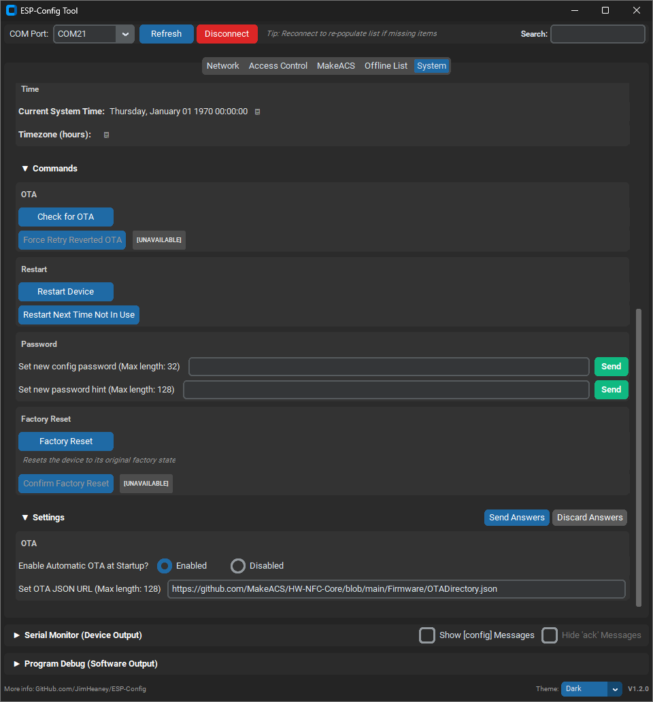

# ESP Config

An asynchronous C++ library for ESP32 devices that exposes dynamic configuration options, action commands, and status diagnostics to a host UI over Serial using a standardized JSON protocol, that is then displayed graphically on a host computer. 

Hard-coding information like Wi-Fi credentials, or having to write out a structure for ingesting settings over serial in every project was getting tiring, so I put together this library to handle it.

`ESPConfig` runs communication in a background FreeRTOS thread, keeping your `loop()` clean and lets you use blocking code without concerns.



---

## Features

* Supports Multiple Data Types and Formats:
    * **Questions**: Prompt users for string, integer, choice, or multi-selection inputs.
    * **Commands**: Expose trigger buttons, latching toggles, or text commands.
    * **Information**: Stream live, read-only diagnostic metrics.
* **Dynamic Control**: Update options, availability, and feedback messages at runtime.
* **Advanced UI Features**: Change text colors based on good/bad results, give pop-up warnings before a user does something dangerous.
* **Scalable Design**: Questions, commands, and information can be categorized and grouped to make a more logical flow in large projects.
* **Built-In Serial Terminal**: You can still use serial for all your other debug messages and see them in the config software.

---

## Quick Start

```cpp
#include "ESPConfig.h"

ESPConfig config;

void handleSSID(String ssid) {
  config.updateQuestion("WiFi", "ssid", ssid, "[good] SSID saved.");
}

void setup() {
  // Start library (optional password and hint parameters)
  config.begin("admin123", "Default pass is 'admin123'");

  // Register an input question
  config.addStringQuestion("WiFi", "ssid", "Credentials", "Network Name", "", 32, handleSSID);

  // Register status information
  config.addInformation("WiFi", "status", "Status", "Disconnected");
}

void loop() {
  // FreeRTOS handles serial I/O in the background automatically
}
```

---

## Examples

* **blink-config**: Set the rate of a blinking LED, or manually control it.
  * *Warning:* makes use of the *LED_BUILTIN* macro. May not work if your board does not have an LED!
  * Demonstrates choice question, integer question, and button command
* **rgb-config**: Set the brightness and color of an RGB LED.
  * *Warning:* makes use of the *RGB_BUILTIN* macro. May not work if your board does not have a WS2812 LED!
  * Demonstrates the use of a multi-select question.
* **basic-wifi-config**: Set Wi-Fi credentials and connect to the network.
  * Demonstrates basic information usage.
* **advanced-wifi-config**: Scan for in-range networks, connect to one, and test the network connection.
  * Demonstrates more complex library usage, multiple questions and commands, and password protection selectively-applied.

---

## Configuration Software

The configuration software is written in Python, and can be found in *\software\python*.

A pre-compiled Windows executable can be found at *\software\python\dist\esp_config.exe*.

In the future, I may try to make a WebSerial-based version hosted on GitHub pages.

---

## API Reference

### 1. Initialization & Auth

| Function | Description |
| :--- | :--- |
| `begin(password, hint)` | Initializes Serial at 115200 baud and starts background FreeRTOS task. A password and a password hint can optionally be set, to password lock some/all questions and commands. Pass empty strings for no password. |
| `isAuthenticated()` | Returns `true` if password has been verified or no password is required. |
| `resetAuthentication()` | Locks protected items until password is provided again. |

---

### 2. Adding Questions (User Inputs)

Callbacks receive the user's input as a `String`.

```cpp
// Choice (Select one option of many)
config.addChoiceQuestion(source, id, category, prompt, defaultValue, optionsVector, callback, protectedVal, unavailable);
// source: used to group content as well as identify it uniquely. Ex: Can mark that these questions came from the "WiFiHandler" function.
// id: used to uniquely identify a question inside of a source. Not displayed.
// category: questions, info, and commands are sorted into tabs by category. Ex: All wifi-related stuff can be in the "Network" category.
// prompt: question posed to the user
// defaultValue: current value rendered in the question field
// optionsVector: the options that the user can select. Ex: {"Chicken", "Beef", "Fish", "Vegetarian"}
// callback: the function that should be called when we get a response to this question.
// protectedVal: if true, the user has to enter a password before editing this question.
// unavailable: if true, the question will be greyed out. Ex: can grey out wifi-related settings when wifi is turned off.

// Selection (Select some number of the options (0-all))
config.addSelectionQuestion(source, id, category, prompt, defaultValue, optionsVector, callback, protectedVal, unavailable);
// (same as the choice question paramters)

// Integer (Bounded Numeric Input)
config.addIntegerQuestion(source, id, category, prompt, defaultValue, lowerLimit, upperLimit, callback, protectedVal, unavailable);
// (mostly the same as the choice question paramters)
// lowerLimit: values below this will be denied.
// upperLimit: values above this will be denied.


// String (Text Input)
config.addStringQuestion(source, id, category, prompt, defaultValue, maxLength, callback, protectedVal, unavailable);
// (mostly the same as the choice question paramters)
// maxLength: strings above this character count will be denied.
```

---

### 3. Adding Commands (Actions)

Callbacks receive a `bool` (pressed/unpressed for buttons/latches) or `String` (for string commands).

```cpp
// Action Button
config.addButtonCommand(source, id, category, title, buttonCallback, popupText, message, implyEnd, protectedVal, unavailable);
// (source, id, category, protectedVal, unavailable work the same as questions)
// title: the text to display on the button
// buttonCallback: function to call when a button state change happens
// popupText: if set, the user will be prompted with a pop-up with this text asking to confirm their press before continuitng. Good for high-risk options!
// message: a display tooltip from hovering over a "?" icon near the button, to explain better what it does.
// implyEnd: tells the software that when this button is pressed, the ESP32 will stop communicating. Ex: "restart device" button.

// Latching Toggle Button
config.addLatchCommand(source, id, category, title, buttonCallback, popupText, message, implyEnd, protectedVal, unavailable);
// (same as the button command)

// Text Command Line
config.addStringCommand(source, id, category, title, stringCallback, maxLength, popupText, message, implyEnd, protectedVal, unavailable);
// (pretty much the same as the other commands, but with "maxLength" same as in the string question)
```

---

### 4. Adding Information (Read-Only Status)

```cpp
config.addInformation(source, id, title, value, category, explanation);
// (source, id, category work the same as questions and commands)
// title: the name of the information. Ex: "MAC Address: "
// value: the value of the data. Ex: "00:00:00:00:00"
// explanation: hover-over tooltip about what this info is.
```

---

### 5. Dynamic Runtime Updates

Update elements on the fly from anywhere in your firmware[cite: 4, 5]:

```cpp
// Update question value and status message
config.updateQuestion("WiFi", "ssid", "Home-WiFi", "[good] Connected!");
// status message is displayed to show a response to a question's answer.

// Update choices list dynamically (e.g., after a Wi-Fi scan)
config.updateQuestionOptions("WiFi", "ssid_select", ssidListVector, defaultSelected);

// Enable/Disable UI elements dynamically
config.updateQuestionAvailability("WiFi", "ssid", isUnavailable);
config.updateCommandAvailability("WiFi", "reboot", isUnavailable);
// if set to true, will grey out the question to stop interaction.

// Update status command feedback or readout values
config.updateCommand("WiFi", "reboot", "[time] Rebooting...");
config.updateInformation("WiFi", "status", "Connected", "Signal: -65dBm");
```

---

**UI Message Formatting Tags**

Messages support some formatting tags that will change how the content is rendered:

* **`[good]`** Makes the entire message green, to indicate a success or similar.
* **`[bad]`** Makes the entire message red, to indicate an error or similar.
* **`[time]`** Replaced with "HH:MM:SS" system time when displayed.
